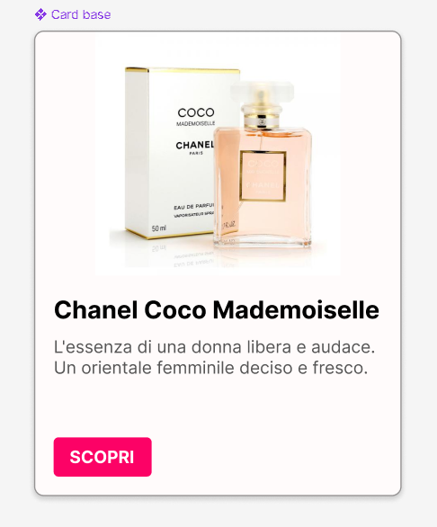

# 🚀 Progetto Card UI: Dal Design in Figma allo Sviluppo in React con Bootstrap

Questo progetto dimostra la creazione di un componente "Card" per l'interfaccia utente, seguendo i principi dell'**Atomic Design** e le **Linee Guida di Material Design**, implementato utilizzando **React**, **JavaScript** e **Bootstrap**.

## 🎨 1. Design della Card in Figma

Il design della card è stato realizzato in Figma, seguendo principi di design moderni per garantire modularità e coerenza visiva.

### 1.1 Obiettivo del Design 

L'obiettivo primario era di progettare una card visivamente accattivante e funzionale, capace di contenere un'immagine di anteprima, un titolo descrittivo, un testo esplicativo e un bottone. Il tutto è stato realizzato attenendosi rigorosamente al metodo *Atomic Design* e alle linee guida di *Material Design* , focalizzandosi unicamente sulla progettazione visiva, senza includere prototipazione o animazioni in questa fase iniziale. L'intento è stato quello di utilizzare frame, griglie e altre best practice di Figma per ottenere un design pulito e coerente.

### 1.2 Concetti di Design Applicati

Abbiamo utilizzato due metodologie principali:

* **Atomic Design**: Questo approccio ci ha permesso di costruire la card in modo modulare, scomponendola in elementi base ("atomi" come immagine, testo, bottone) che poi si combinano per formare l'intera "molecola" (la card). 
* **Material Design Guidelines**: Per un aspetto professionale e coerente, abbiamo seguito le linee guida di Google Material Design. Questo ha influenzato la gerarchia del contenuto, le spaziature (utilizzando multipli di 8px), l'enfasi visiva di titoli e descrizioni, e lo stile generale della card (angoli arrotondati, leggere ombre).

## ✨ 2. La Card Progettata

Ecco un'anteprima della card così come è stata progettata in Figma. Questa immagine serve da riferimento visivo dettagliato per la fase di sviluppo, mostrando tutti gli elementi e le spazialità definite.

### 2.1. Anatomia e Tematica della Card

Analizziamo i componenti chiave della card rappresentata nell'immagine:



La card è stata pensata per presentare un **prodotto**, in questo caso un profumo ("Chanel Coco Mademoiselle").    
I suoi componenti principali sono:

* **Contenitore principale**: un frame con angoli arrotondati e una sottile ombra per un effetto di profondità.
* **Immagine di copertina**: un elemento visivo prominente nella parte superiore, che rappresenta il prodotto.
* **Titolo**: un testo in evidenza (più grande e in grassetto) per il nome del prodotto.
* **Descrizione**: un testo più piccolo che fornisce dettagli aggiuntivi sul prodotto.
* **Bottone di azione**: un chiaro `call-to-action` (es. "SCOPRI") posizionato in basso, per guidare l'utente all'interazione.

Ogni elemento è stato posizionato con precisione, rispettando le spazialità definite dal sistema di 8px per garantire armonia e bilanciamento visivo, come richiesto dalle linee guida Material Design.


### 2.2 Passaggi per la Creazione della Card in Figma

1.  **Crea il frame della Card**: definisci la base della card (es. 320x400px) con riempimento bianco, angoli arrotondati (8px), una leggera ombra e abilita la griglia 8px.
2.  **Inserisci l'immagine**: aggiungi un rettangolo immagine nella parte superiore del frame, impostando larghezza pari alla card e altezza di circa 180px, riempiendolo con un'immagine con l'opzione "Fill".
3.  **Aggiungi il titolo**: inserisci il titolo (es. "Chanel Coco Mademoiselle") sotto l'immagine. Usa un font leggibile, dimensione ~20px Bold, colore scuro, con 16px di margine dal bordo sinistro e sotto l'immagine.
4.  **Aggiungi la descrizione**: sotto il titolo, inserisci il testo descrittivo. Usa un font più piccolo (~14-16px Regular), colore leggermente più chiaro, mantenendo il margine sinistro e uno spazio di 8-12px dal titolo.
5.  **Crea il Bottone di azione**: disegna un rettangolo per il bottone (es. 80x32px) con riempimento colorato e angoli a 4px. Aggiungi il testo "SCOPRI" (~14px Bold, bianco) centrato al bottone. Raggruppa i due elementi e posiziona il bottone in basso a destra (es. 16px dai bordi).

## 💻 3. Tecnologie Utilizzate

- 
- 
- 
- 
- 
-  

## ▶️ 4. Passaggi per Avviare il Progetto
1. Clona il Repository del progetto:
```
git clone https://github.com/giorgiameffe/figma-react-card.git
```
2. Spostati nella Directory del progetto:
```
cd figma-react-card
```
3. Installa le Dipendenze:
```
npm install
```
4. Avvia il Server di sviluppo:
```
npm run dev
```


